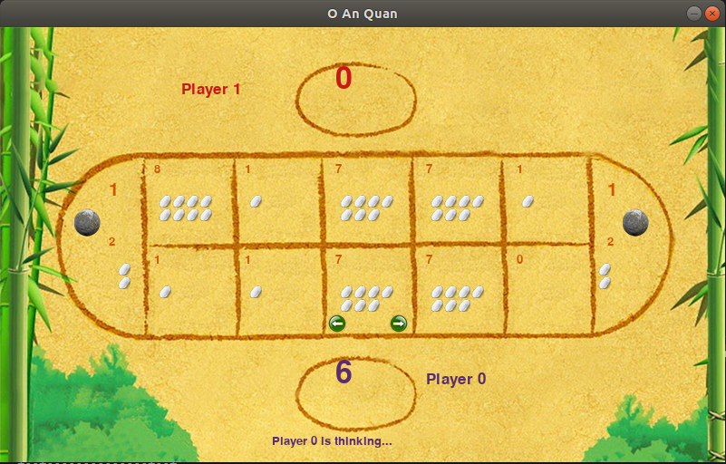

## Introduction
This is my mini project in Artificial Intelligent course. We have experimented and implemented two algorithms minimax and expectimax.


## Contributors
- Dang Quang Minh (leader): construct game logic and design program architecture.
- Le Tuan Son: implement two AI algorithms minimax and expectimax.
- Nguyen Tri Hung: build game UI.
- Nguyen Viet Hoang: write report.

## Installation
### System Requirements
- Python 3.6
- Libaries: pygame, tkinter,...

```
python3 -m pip install pygame
```

## Usage
```
python main.py
```

## Demo



